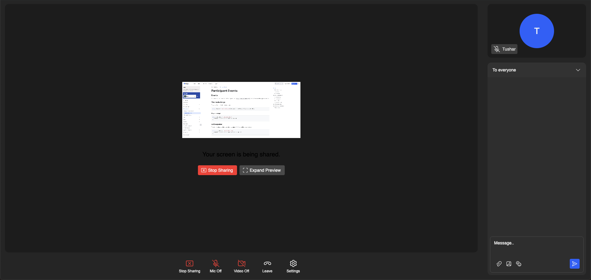

# Active Speaker UI Sample

This sample showcases how you can build a UI to display only the active speaker while screenshare in an webinar meeting with Dyte's React UI Kit!

---

[See source](./src/App.tsx)
