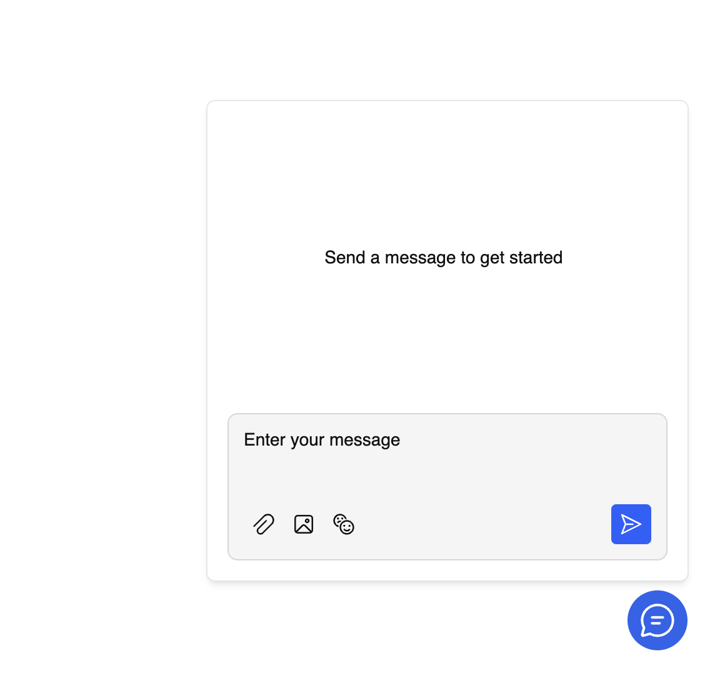

# RealtimeKit Chat Widget demo

This sample showcases how you can build a Chat widget using RealtimeKit Chat SDK

---

[See source](./src/components/App.tsx)

## Getting started

1. rename `.env.sample` to `.env` and update the variables with your organization details
2. `npm install`
3. `npm run dev`
