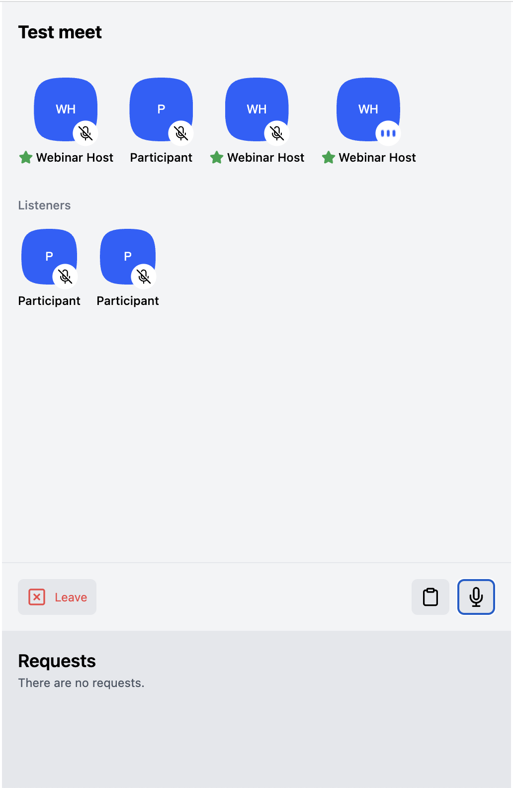
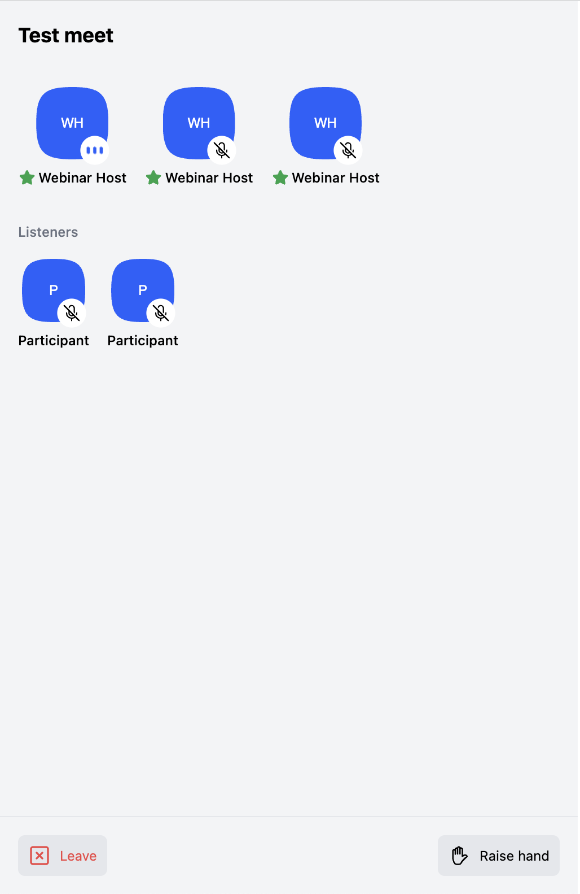

# Default Meeting UI Sample

This sample showcases the simplest way to create a Clubhouse clone with RealtimeKit's React UI Kit!

## Prerequisites

1. Preset for Speaker should have the following.
- Stage & Media Enabled
- Accept Requests Enabled
- "Allowed to Join" as Behaviour

2. Preset for Listener should have the following.
- Stage & Media Enabled
- Accept Requests Disabled
- "Can request to join" as Behaviour

### Screenshots

Speaker's UI:

Listener's UI:

[See source](./src/App.tsx)
