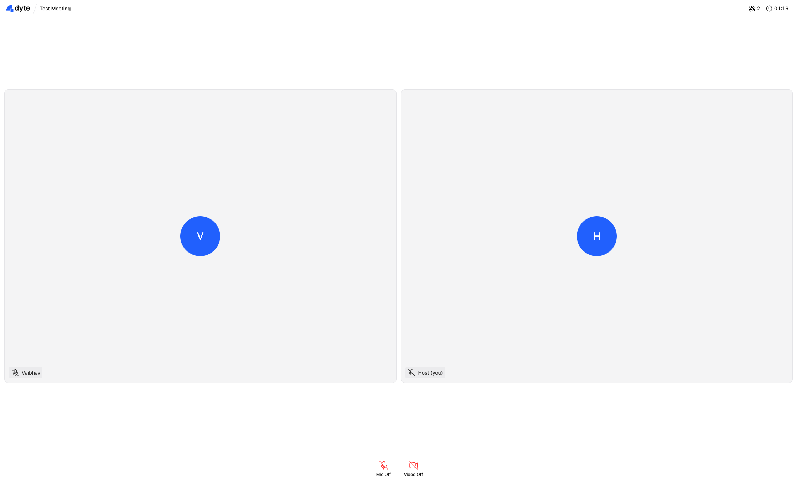

# Simple Meeting UI Sample

This sample showcases how you can create a simple Meeting UI on your own.

Note that this is a very bare bones example of how you can build your own UI
from scratch.

---

[See source](./src/components/Meeting.tsx)
